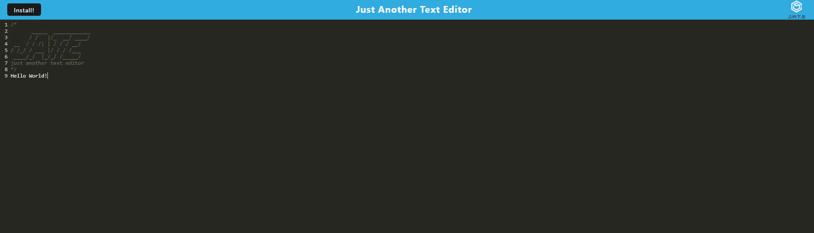

# myTextEditor
by Heather Weltzien

## Table of Contents
* [Description](#description)
* [Installation](#installation)
* [Usage](#usage)
* [Credits](#credits)
* [License](#license)
    
## Description
    myTextEditor is a text editor that runs in the browser. It is a single-page application that meets the PWA criteria. Additionally, it features a number of data persistence techniques that serve as redundancy in case one of the options is not supported by the browser. The application also functions offline. Technologies include IndexedDB database, idb, and IndexedDB API. 

## Installation
    Run "cd client && npm i && cd ../server && npm i" in the terminal.
    
## Usage
    Run "npm run build && cd server && node server.js" in the terminal. 

<a href="https://mytexteditor-7oe4.onrender.com/" target="_blank">Link to deployed application</a>

    
## Credits
<ul>    
    <li>Tutoring session with Siddharth Shekhar</li>
   
</ul>    

## License
    NONE